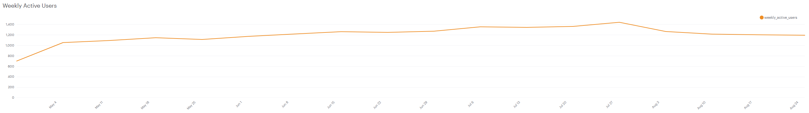

# SQL 날짜 처리
## 기본적인 날짜 형태
SQL에서 기본적인 날짜 형태는 년도-월-일 순이다. 즉, 보통 'YYYY-MM-DD' 형식으로 날짜를 표현한다. 또한 이런 형식으로 Date 와 함께 시간을 표현할 때는 시간:분:초 순으로 표현한다. 이렇게 date 와 time 형식으로 data type 이 지정되었을 때 우리는 강력한 기술들을 발휘할 수 있다. 예를들어 특정 날짜 이후 한주 뒤의 날짜에 해당하는 field 를 퀴리 한다던지, 또는 두 field 간의 시간 차를 구하던지 할 수 있다.  

SQL로 DB에 올바르게 date 와 time 이 저장되었다면 보통 'interval' 의 data type 으로 저장이 된다(int 형 리스트 형태로, 각 자리는 각기다른 시간의 interval을 나타냄). 아래 쿼리는 각 회사들이 인수되기까지 걸린 날을 쿼리하는 쿼리문이다(인수되지 않은 회사는 제외). 여기서 'founded_at_clean' 컬럼은 string 형식으로 저장되기 때문에, timestamp 형식으로 캐스팅(형변환) 해줘야 한다. 

```SQL
SELECT companies.permalink,
       companies.founded_at_clean,
       acquisitions.acquired_at_cleaned,
       acquisitions.acquired_at_cleaned -
         companies.founded_at_clean::timestamp AS time_to_acquisition
  FROM tutorial.crunchbase_companies_clean_date companies
  JOIN tutorial.crunchbase_acquisitions_clean_date acquisitions
    ON acquisitions.company_permalink = companies.permalink
 WHERE founded_at_clean IS NOT NULL
 ```
캐스팅 방식은 위에처럼 ```::{타입 명}``` 을 사용하여 캐스팅할 수 있고 MySQL의 경우 ```CAST({변수} AS {타입 명})``` 형식으로 할 수도 있다. 위 예제에서 ```time_to_acquisition``` 컬럼은 기간으로, 다른 날짜 타입은 아니다. (그림 1 참조)

여기에 더해서 ```INTERVAL``` 함수를 사용해서 interval 을 표현하는 것도 가능하다.

```SQL
SELECT companies.permalink,
       companies.founded_at_clean,
       companies.founded_at_clean::timestamp +
         INTERVAL '1 week' AS plus_one_week
  FROM tutorial.crunchbase_companies_clean_date companies
 WHERE founded_at_clean IS NOT NULL
```
이렇게 하면 주 단위로 
